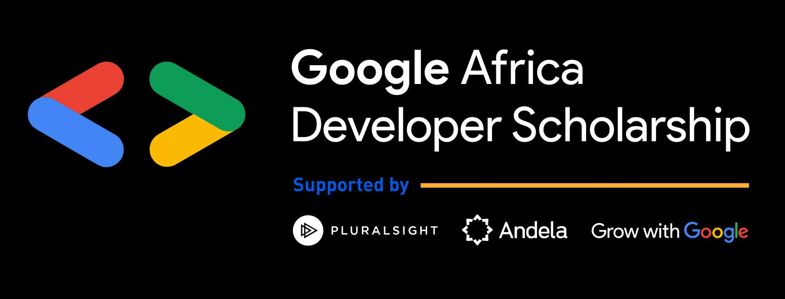
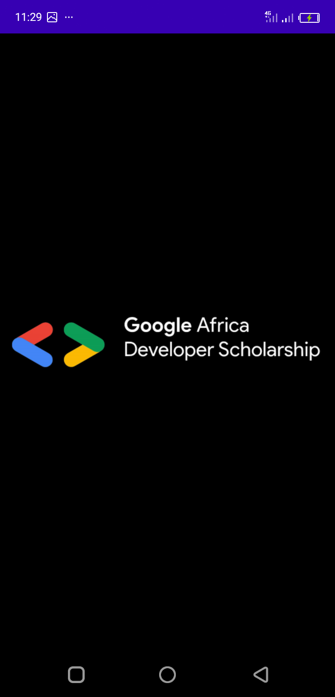
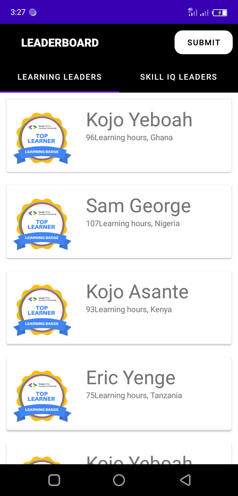
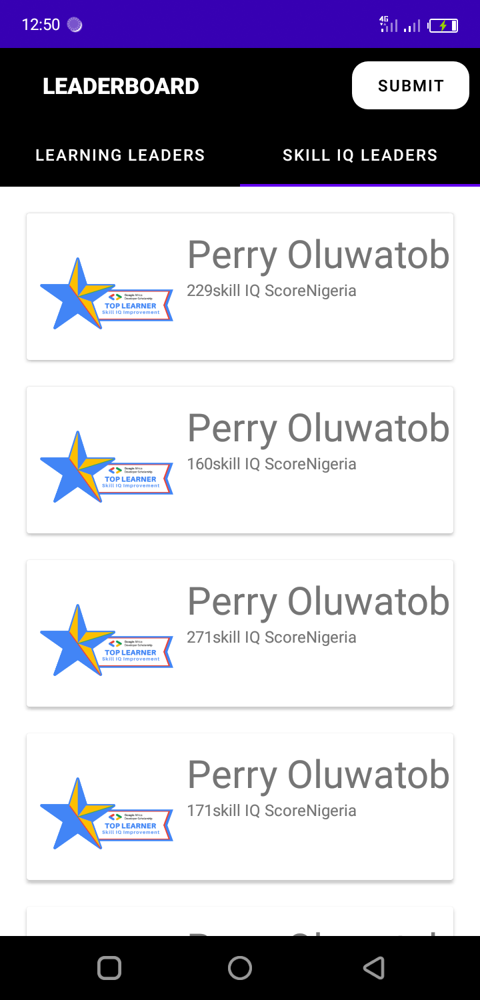
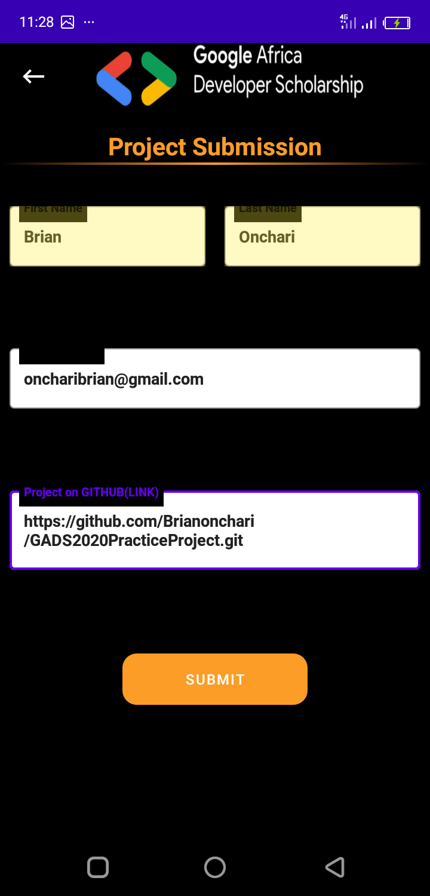
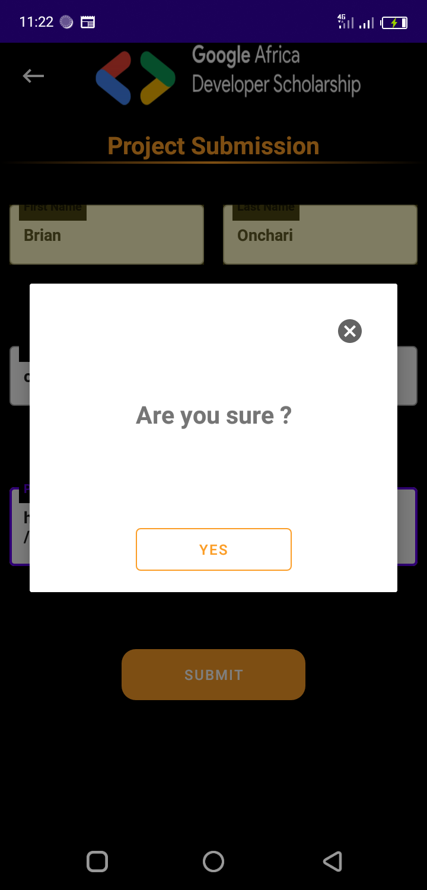
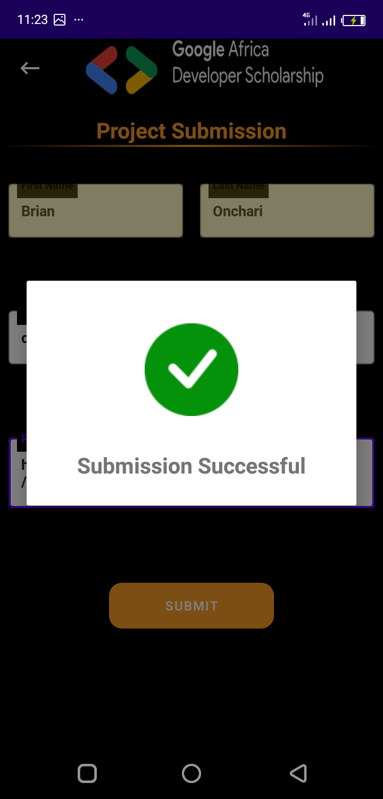
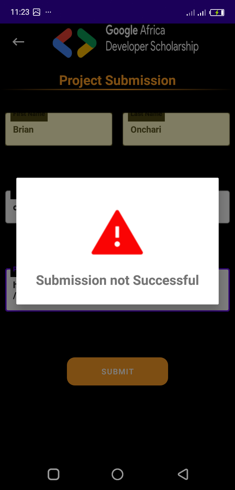

# GADS2020PracticeProject

Android practice project for GADS 2020

### Architecture
 MVVM Architecture

## Dependancies
- Dagger Hilt
- Retrofit
- Coroutines
- Viewmodel and LiveData

### Api
 baseUrl (https://gadsapi.herokuapp.com)
 
 ### ScreenShots
 
   
 
    
    
 
 
 
